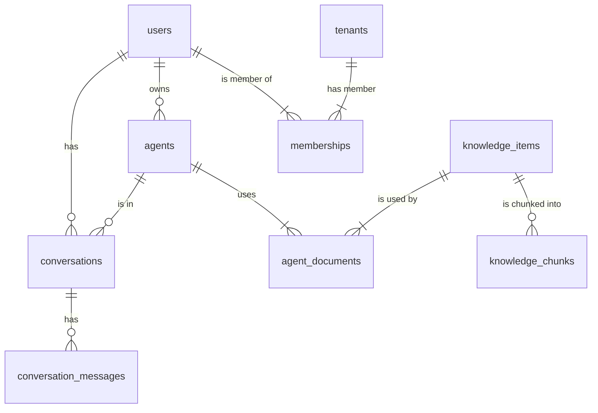

# Documentação Técnica Completa — ORKIO v3.10.0

**Autor**: Manus AI
**Data**: 14 de Novembro de 2025

## 1. Visão Geral

Este documento detalha a arquitetura técnica completa do projeto **ORKIO**, incluindo backend (FastAPI), frontend (Next.js), banco de dados (PostgreSQL), infraestrutura (Docker) e fluxos de dados. O objetivo é fornecer um blueprint claro para auditoria, correção e evolução da plataforma.

O projeto está estruturado como um monorepo com duas aplicações principais:
- `backend`: API em FastAPI (Python)
- `web`: Frontend em Next.js (React/TypeScript)

A orquestração é feita via `docker-compose.yml`, que sobe os serviços de API, web e banco de dados.

## 2. Backend (FastAPI)

A API é construída com FastAPI e segue uma arquitetura modular, separando rotas, serviços, modelos e configurações.

### 2.1. Arquitetura de Diretórios

```
/backend
├── app/
│   ├── api/            # Endpoints da API (rotas)
│   │   ├── admin/      # Rotas do painel de admin
│   │   └── users/      # Rotas do console de usuário
│   ├── core/           # Configurações e segurança
│   ├── db/             # Conexão com banco de dados
│   ├── models/         # Modelos SQLAlchemy
│   ├── rag/            # Lógica de RAG
│   └── services/       # Lógica de negócio (LLM, RAG)
├── migrations/         # Migrations Alembic
├── alembic.ini         # Configuração do Alembic
├── Dockerfile          # Container da API
├── requirements.txt    # Dependências Python
└── .env                # Variáveis de ambiente
```

### 2.2. Rotas (Endpoints)

A API é dividida em três grandes áreas: **Admin**, **Users Console (u)** e **Auth**.

#### Rotas de Admin

| Rota                               | Verbo  | Descrição                                   |
| ---------------------------------- | ------ | --------------------------------------------- |
| `/admin/agents`                    | GET    | Lista todos os agentes                        |
| `/admin/agents/{id}`               | PUT    | Atualiza um agente                            |
| `/admin/users/pending`             | GET    | Lista usuários pendentes de aprovação         |
| `/admin/users`                     | GET    | Lista todos os usuários                       |
| `/admin/users/{id}/approve`        | POST   | Aprova um usuário                             |
| `/admin/users/{id}`                | DELETE | Deleta um usuário                             |
| `/admin/agent-dialogs`             | GET    | Lista diálogos entre agentes                  |
| `/admin/agent-send`                | POST   | Envia mensagem de um agente para outro        |
| `/admin/rag/events`                | GET    | Lista eventos RAG para auditoria              |

#### Rotas do Users Console (`/u`)

| Rota                               | Verbo  | Descrição                                   |
| ---------------------------------- | ------ | --------------------------------------------- |
| `/u/register`                      | POST   | Registra novo usuário                         |
| `/u/login`                         | POST   | Autentica usuário e retorna token JWT         |
| `/u/agents`                        | GET    | Lista agentes habilitados para o usuário      |
| `/u/chat`                          | POST   | Envia mensagem para um agente (com RAG)       |
| `/u/conversations`                 | GET    | Lista as conversas do usuário                 |
| `/u/conversations`                 | POST   | Cria uma nova conversa                        |
| `/u/conversations/{id}`            | PATCH  | Renomeia uma conversa                         |
| `/u/conversations/{id}`            | DELETE | Deleta uma conversa                           |
| `/u/conversations/{id}/messages`   | GET    | Lista as mensagens de uma conversa            |
| `/u/conversations/{id}/attachments`| POST   | Faz upload de arquivo para uma conversa       |

### 2.3. Autenticação

- **Estratégia**: Token JWT (JSON Web Token) Bearer.
- **Fluxo de Login**:
  1. Usuário envia `email` e `password` para `/u/login`.
  2. Backend valida as credenciais com `passlib` (Argon2).
  3. **(PROBLEMA ATUAL)** O backend verifica se o usuário tem um `workspace` (via tabela `memberships`). **Esta verificação está falhando e foi temporariamente desabilitada**.
  4. Um token JWT é gerado com `sub` (ID do usuário), `tenant_id` e `role`.
  5. O token é retornado ao frontend, que o armazena no `localStorage` (`orkio_u_token`).
  6. Requisições subsequentes incluem o token no header `Authorization: Bearer <token>`.
- **Segurança**: A função `get_current_user` (em `security.py`) valida o token em cada rota protegida.

### 2.4. Fluxo de Chat e RAG

O endpoint principal é `POST /u/chat`.

1. **Recebimento**: Recebe `agent_id`, `message` e `conversation_id`.
2. **Busca do Agente**: O agente é carregado do banco de dados.
3. **Verificação RAG**: Se `agent.use_rag` for `True`:
   a. A função `retrieve_context` (em `rag_service_v37.py`) é chamada.
   b. A query do usuário é vetorizada usando `text-embedding-3-small`.
   c. O serviço busca todos os `KnowledgeChunk` vinculados ao agente (via tabela `agent_documents`).
   d. **(LIMITAÇÃO)** A similaridade de cosseno é calculada em Python (sem `pgvector`), o que pode ser lento.
   e. Os chunks mais relevantes são retornados como `context_blocks`.
4. **Montagem do Prompt**: O prompt final é montado com:
   - Propósito do agente (prompt do sistema).
   - Contexto RAG (se houver).
   - Histórico da conversa (se houver).
   - Mensagem atual do usuário.
5. **Chamada ao LLM**: A função `llm_chat` (em `llm_manager.py`) faz a chamada para a API da OpenAI (via proxy do Manus) com o modelo e temperatura do agente.
6. **Persistência**: A mensagem do usuário e a resposta do assistente são salvas na tabela `conversation_messages`.
7. **Retorno**: A resposta do LLM é retornada ao frontend.

### 2.5. Fluxo Multi-Agentes (Daniel → CFO)

O endpoint `POST /admin/agent-send` simula uma comunicação entre agentes.

1. **Recebimento**: Recebe `from_agent_id`, `to_agent_id` e `message`.
2. **Criação de Diálogo**: Um `agent_dialog` é criado ou reutilizado para agrupar a interação.
3. **Registro de Evento**: A mensagem de origem é registrada na tabela `agent_dialog_events`.
4. **Invocação Interna**: O agente de destino é invocado via `llm_chat`, com um prompt de sistema que inclui a mensagem do agente de origem.
5. **Registro da Resposta**: A resposta do agente de destino também é registrada em `agent_dialog_events`.
6. **Retorno**: A resposta é retornada ao chamador.

## 3. Banco de Dados (PostgreSQL)

### 3.1. Schema Completo

**Tabelas Principais**:

- `users`: Armazena usuários e credenciais.
- `agents`: Configuração dos agentes (LLM, RAG, etc.).
- `tenants`: Inquilinos (workspaces) - **ESTRUTURA AUSENTE/INCOMPLETA**.
- `memberships`: Vincula usuários a tenants - **ESTRUTURA AUSENTE/INCOMPLETA**.
- `conversations`: Cabeçalho das conversas do chat.
- `conversation_messages`: Mensagens de cada conversa.
- `knowledge_items`: Metadados dos documentos de RAG.
- `knowledge_chunks`: Pedaços de texto vetorizados dos documentos.
- `agent_documents`: Vincula agentes a documentos de RAG.
- `rag_events`: Log de auditoria para eventos RAG.
- `agent_dialogs`: Cabeçalho dos diálogos entre agentes.
- `agent_dialog_events`: Mensagens trocadas entre agentes.

**Diagrama de Entidade-Relacionamento (Simplificado)**:



### 3.2. Migrations (Alembic)

- **Local**: `/backend/migrations/versions/`
- **Status Atual**: **INCOMPLETO**. As migrations existentes não criam todas as tabelas necessárias (`conversations`, `messages`, `tenants`, `memberships`, etc.).
- **Comando para Rodar**: `docker compose exec api alembic upgrade head` (conforme `README.md`).
- **Problema**: O schema do banco está sendo criado parcialmente via `Base.metadata.create_all(bind=engine)` no `main.py`, e parcialmente via SQL direto nos endpoints, o que causa inconsistência.

## 4. Frontend (Next.js)

### 4.1. Arquitetura de Diretórios

```
/web
├── src/
│   ├── components/   # Componentes React (vazio)
│   ├── lib/          # Funções de API (api.ts, api-u.ts)
│   ├── pages/        # Rotas da aplicação
│   │   ├── u/        # Páginas do Users Console
│   │   └── _app.tsx  # Layout principal
│   └── styles/       # CSS global
├── public/           # Arquivos estáticos (imagens)
├── next.config.js    # Configuração do Next.js
└── package.json      # Dependências
```

### 4.2. Fluxo de Autenticação (Client-Side)

1. **Login**: A página `/u/login` envia as credenciais para a API.
2. **Token**: Após sucesso, o token JWT é salvo no `localStorage` com a chave `orkio_u_token`.
3. **Interceptor Axios**: O arquivo `lib/api-u.ts` possui um interceptor do Axios que anexa o token a todas as requisições para o backend.
4. **Redirecionamento**: O usuário é redirecionado para a página de chat (`/u/chat`).

### 4.3. Fluxo do Chat (`/u/chat.tsx`)

- **Componente Principal**: `ChatPage`.
- **Estado**: Gerenciado com `useState` para agentes, conversas, mensagens, etc.
- **Carregamento de Dados**: `useEffect` é usado para carregar agentes e conversas ao montar o componente.
- **Envio de Mensagem**: A função `handleSendMessage` chama `sendMessage` do `lib/api-u.ts`, que faz a requisição `POST /u/chat`.
- **Renderização**: As mensagens são renderizadas em um loop (`map`), com estilos diferentes para `user` e `assistant`.
- **Streaming**: **NÃO IMPLEMENTADO**. A resposta do LLM é aguardada por completo antes de ser exibida.

### 4.4. Integração com OpenAI

- **Lado do Cliente**: Nenhuma chamada direta para a OpenAI.
- **Lado do Servidor**: O `llm_manager.py` faz chamadas para o endpoint `https://api.openai.com/v1/chat/completions` (ou um proxy configurado pelo Manus).
- **Modelos Utilizados**: O modelo é definido por agente (`agent.llm_model`), com fallback para `gpt-4o-mini`.

## 5. Infraestrutura (Docker)

- **Arquivo de Configuração**: `docker-compose.yml`.
- **Serviços**: 
  - `db`: Imagem `postgres:16`.
  - `api`: Builda o `Dockerfile` do backend e expõe a porta `8000`.
  - `web`: Builda o `Dockerfile` do frontend e expõe a porta `3000`.
- **Variáveis de Ambiente**: Definidas no `docker-compose.yml` e passadas para os containers. O arquivo `.env.example` serve como template.
- **Proxy Reverso**: **NÃO HÁ**. O acesso é direto às portas `3000` (web) e `8000` (api), o que não é ideal para produção.

## 6. Resumo dos Problemas e Recomendações

1. **Banco de Dados Inconsistente**: O schema não é totalmente gerenciado por migrations, causando a ausência de tabelas críticas (`conversations`, `tenants`).
   - **Recomendação**: Gerar migrations completas a partir dos `models.py` e usá-las como única fonte da verdade para o schema.

2. **Lógica de Workspace Quebrada**: A ausência da tabela `memberships` quebra o fluxo de login.
   - **Recomendação**: Implementar corretamente o modelo de `tenants` e `memberships`.

3. **RAG Não Otimizado**: A similaridade de cosseno em Python é ineficiente para grandes volumes de dados.
   - **Recomendação**: Utilizar `pgvector` no PostgreSQL para buscas de similaridade aceleradas por índice.

4. **Frontend Sem Streaming**: A experiência do usuário no chat é prejudicada pela falta de respostas em tempo real.
   - **Recomendação**: Implementar Server-Sent Events (SSE) ou WebSockets para streaming de respostas.

5. **Falta de Proxy Reverso**: Acesso direto às portas dos serviços não é seguro nem escalável.
   - **Recomendação**: Adicionar um serviço de proxy reverso (como Nginx ou Caddy) no `docker-compose.yml`.

Este documento serve como ponto de partida para a auditoria e correção do projeto ORKIO.

